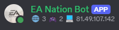

# EA Nation Discord Bot

## Features

- Discord bot activity
    - Current connected player count
    - Current in game player count
    - Current DNS IP Address
- Scoreboards
    - Sends an image of the scoreboard every time a game ends
- Events
    - Sends a message when players connect/disconnect and join/leave games

<br/>
*Discord bot activity*

<br/>
*MoHH Scoreboard*

<br/>
*NFS Scoreboard*

<br/>
*NHL Scoreboard*

## Run

In IntelliJ IDEA, create a new `Application` run configuration.

To start with the `dev` profile (containing database samples), use the following command line argument:

```
-Dspring.profiles.active=dev
```

For the Discord bot to work, you need to define the appropriate environment variables :

- `DNS_NAME` : the DNS name of the server
- `DISCORD_TOKEN` : the token of the Discord bot

Otherwise, comment out the `DiscordBotService` methods.

If you don't want to use the `dev` profile, you have to define the following environment variables :

- `DB_URL` : the URL of the database
- `DB_USERNAME` : the username of the database
- `DB_PASSWORD` : the password of the database

But this requires to run an [EA Nation Server](https://github.com/a-blondel/ea-nation-server) database locally.

The default scoreboard image is generated in the `report` directory. You can change the path using the `REPORTS_PATH`
environment variable.  
